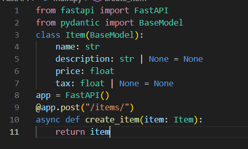

# 请求体
请求体是客户端发送给API的数据，响应体是API发送给客户提的数据。

## 导入Pydantic的BaseModel

>from pydantic import BaseModel

## 创建数据模型，把数据模型声明为BaseModel的类

>class Item(BaseModel):
>
>name:str
>
>description:str|None=None
>
>price:float
>
>tax:fioat|None=None

这里的description和tax都含有默认值None，所以他俩是可选的

## 声明请求体参数
>async def create_item(item: Item):

## 请求体+路径参数
>@app.put("/items/{item_id}")
>
>async def update_item(item_id: int, item: Item):
> 
>   return {"item_id": item_id, **item.dict()}

*FastAPI 能识别与路径参数匹配的函数参数，还能识别从请求体中获取的类型为 Pydantic 模型的函数参数。*
## 请求体+路径参数+查询参数
>@app.put("/items/{item_id}")
>
>async def update_item(item_id: int, item: Item, q: str | None = None):
>
>   result = {"item_id": item_id, **item.dict()}
>
>   if q:
>
>       result.update({"q": q})
>
>   return result

函数参数按如下规则进行识别：

路径中声明了相同参数的参数，是路径参数

类型是（int、float、str、bool 等）单类型参数，是查询参数

类型是 Pydantic 模型的参数，是请求体

**这里+一点自己的小理解，请求体可以看作操作对象，路径参数就是告诉我们在哪里找到它，查询参数可以看作一些附加的操作，上面的代码可以理解为将item_id，请求体Item和q组合为一个新的字典**