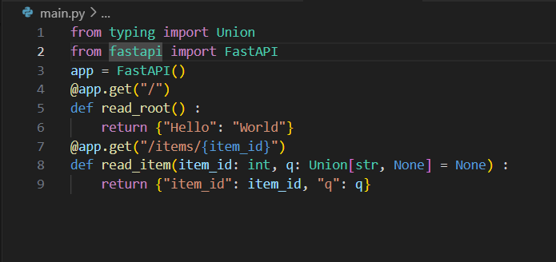
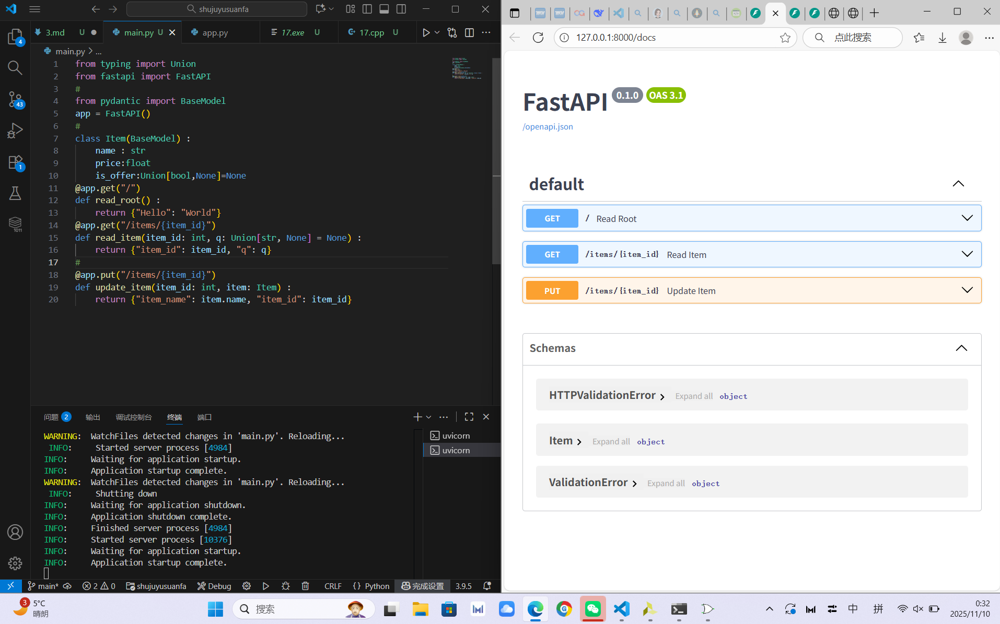
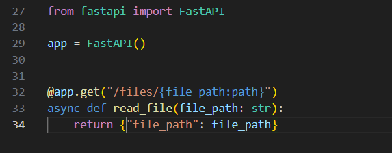

# Fast API
## 安装
终端输入：
>pip install fastapi
>
>pip install "uvicorn[standard]"
## 创建main.py

运行(终端)
>uvicorn main:app --reload

*注意*

若出现无法解析FastAPI，请检查是否安装在指定的python版本上

运行后若终端出现error，请ctrl+s保存

继续加入新的指令，下列代码加入了一个put指令，对应的交互式API也会同步(#后为新加入的代码)

### 创建FastAPI实例
>app=FastAPI()

### 操作
POST：创建数据

GET：读取数据

PUT：更新数据

DELETE：删除数据

>@app.get("/")

这行代码告诉api请求路径为/，操作为get，它的名字叫做装饰器，放在函数上方

>async def root()
>
>def root()

带有async的为异步代码，提高效率，两个都是正确的函数代码

>return {"messadge":"Hello World"}

return返回内容
## 路径参数
### 预设值

简单来说，这里的enum就是给你了一个选项，你只能从我给你的选项里面选择，可以规避一些输入的错误
### 路径转换器

本例中，参数名为 file_path，结尾部分的 :path 说明该参数应匹配路径。可以把他当作万能地址匹配器

*比如*

没有   :path  情况下

匹配：/files/hello.txt

不匹配：/files/folder/hello.txt（因为中间有斜杠 /，即包含路径）

但是如果有：path

以上两种路径都可匹配

