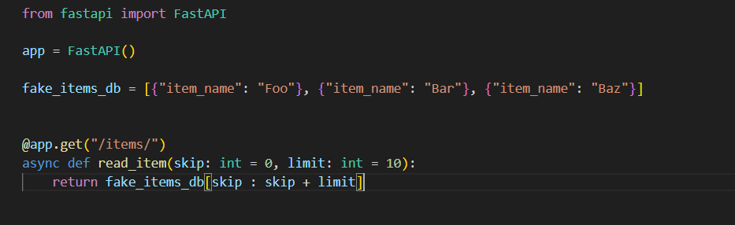
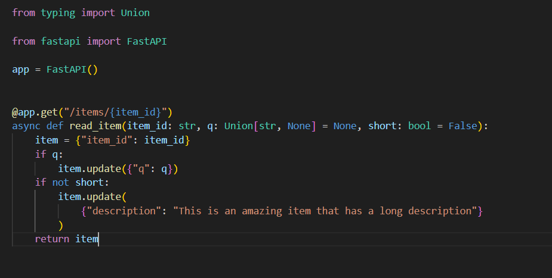

#  查询参数

## 默认值
上例用 skip=0 和 limit=10 设定默认值，可以在URL中自己设定，也可以使用默认值
## 可选参数
同理，把默认值设为 None 即可声明可选的查询参数
## 查询参数类型转换

这里的short取的是bool类型，默认值为False

在这里，访问http://127.0.0.1:8000/items/foo?short=1(True/true/yes)等各种类型，函数接受的short参数都是bool类型True。

## 多个路径和查询参数
FastAPI 可以识别同时声明的多个路径参数和查询参数，通过参数名进行检测
## 必选查询参数
对于不是路径参数的参数：

如果只想把参数设为可选，但又不想指定参数的值，则要把默认值设为 None。

如果要把查询参数设置为必选，就不要声明默认值
>from fastapi import FastAPI
>
>app = FastAPI()
>
>@app.get("/items/{item_id}")
>
>async def read_user_item(item_id: str, needy: str):
>
>   item = {"item_id": item_id, "needy": needy}
>
>   return item

这里的needy就是必选查询参数

因此，在浏览器中打开URL时，路径必须为http://127.0.0.1:8000/items/foo-item?needy=sooooneedy

## 查询参数和字符串校验
引入Query(由fastapi提供)
>async def read_items(q: Union[List[str], None] = None):

>async def read_items(q: Union[List[str], None] = Query(default=None, min_length=2, min_items=1))

Query()明确表明这个参数为查询参数，并且保证参数格式对，fastapi可自动校验，Union只能控制参数的类型及默认值，若想规定参数值就是None，是一个必须参数，可以如下：

>async def read_items(q: Union[str, None] = Query(min_length=3)):

因此，当你在使用 Query 且需要声明一个值是必需的时，只需不声明默认参数.
## 具有默认值的查询参数列表 
>async def read_items(q: List[str] = Query(default=["foo", "bar"])):

这相当于让q为以["foo", "bar"]列表为默认参数
## 别名参数
加入想查询的参数并不是一个有效的python变量名称，此时可以用alias参数声明别名

>async def read_items(q: Union[str, None] = Query(default=None, alias="item-query")):
## 弃用参数
如果有些参数想弃用，可以在Query中加入deprecated=True

**通用的校验和元数据：

alias
title
description
deprecated
特定于字符串的校验：

min_length
max_length
regex**

